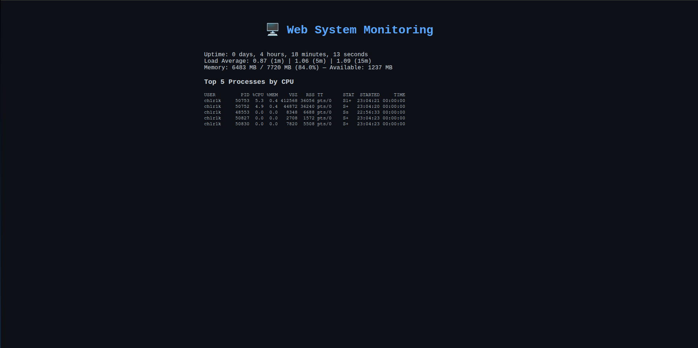

# 🖥️ Web System Monitoring

> Мониторинг Linux-системы через C-утилиты с веб-интерфейсом на чистом JS.

Собирает системную информацию через нативные C-программы и отображает в браузере.

---



## 🚀 Первый запуск

```bash
git clone https://github.com/ваш-юзер/web-system-monitoring.git
cd web-system-monitoring

make build          # компилирует C-утилиты
pip install flask   # если не установлен

python server.py